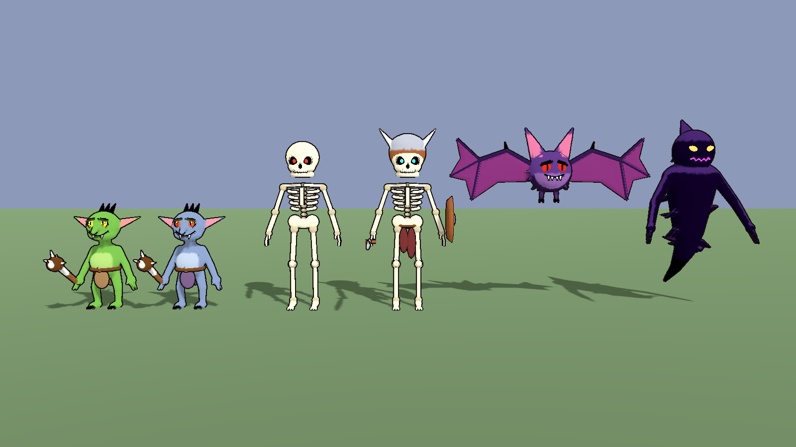
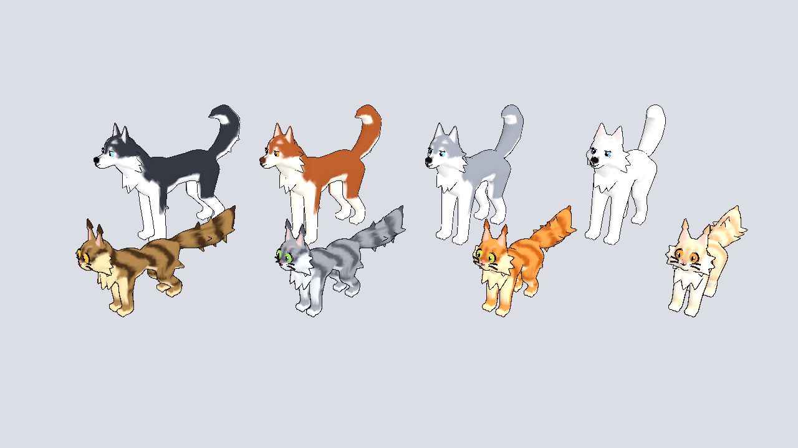
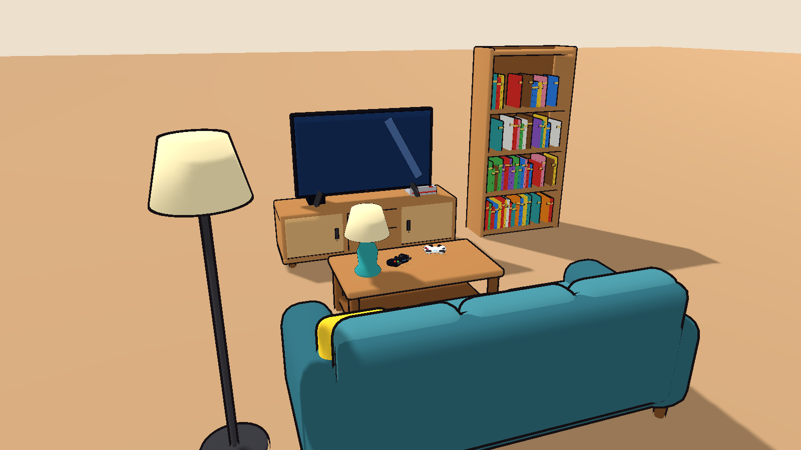
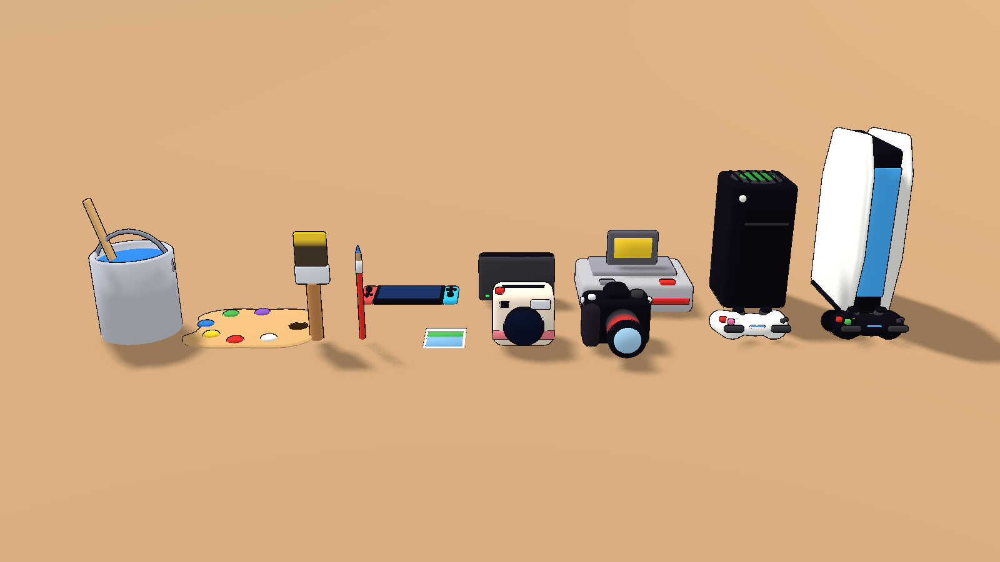
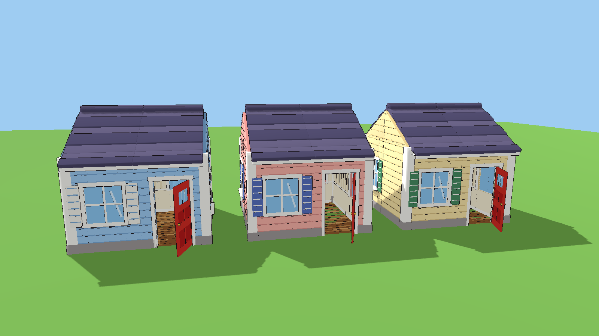
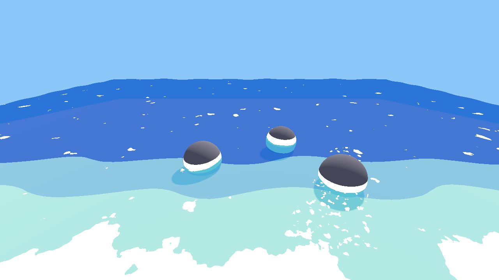

# Art pipeline for the life-sim prototype

Procedurally built, rigged, game-ready models for a Godot 4.7 multiplayer
anime life-sim. The look is **Dragon Quest shapes + Simpsons colors + thick
outlines**. Every model is generated by a Python script running Blender's
`bpy` and exported as `.glb`, and faces **+Z** in Godot.

- Using them in the game: [docs/GODOT_IMPORT.md](docs/GODOT_IMPORT.md)
- Prompt for the Claude in the game project: [docs/LOCAL_CLAUDE_PROMPT.md](docs/LOCAL_CLAUDE_PROMPT.md)
- Prompt telling any Claude where everything is: [docs/FIND_EVERYTHING_PROMPT.md](docs/FIND_EVERYTHING_PROMPT.md)
- Working on the pipeline (for Claude Code and people): [CLAUDE.md](CLAUDE.md)
- Rebuild everything: `PYTHON=python3.13 tools/build_all.sh` (needs `pip install bpy`)
- Preview any asset: `tools/preview/render.sh out.png "monsters/goblin.glb:0:0"`

## Catalog

### Characters — [characters/](characters/README.md)
Hoodie guy (+ black hoodie), casual girl, Egyptian queen (two versions),
built on Meshy base bodies with Godot humanoid bone names for retargeting.

### Beastfolk kit — [characters/beastfolk/](characters/beastfolk/README.md)
One customizable male and female body with 12 species (cat, wolf, fox, bear,
shark, lizard, fish, eel, octopus, manta, coral, human), hybrid or beast
form, outfits and colors driven by a Godot script. Plus shark and wolf NPCs.

### Egyptian warriors and weapons — [characters/egypt/](characters/egypt/README.md), [characters/weapons/](characters/weapons/README.md)
Anubis guard, axe warrior, archer; spear, axe, bow, quiver.

### Monsters — [monsters/](monsters/README.md)
Goblins, skeletons, nightmare bat and shadow entity, each with its own rig
and idle / walk / attack animations; glowing eyes as a separate mesh.

### Pets — [pets/](pets/README.md)
Husky and Maine Coon in 8 coats, rigged with an idle animation.

### Farm animals — [farm/](farm/README.md)
Cows, sheep, chickens and five horse coats, rigged with idle animations.

### Farm props — [props/farm/](props/farm/README.md)
Barn with sliding doors, hay (bales, round bale, pile), stalls, fences,
chicken coop, nest box, eggs, trough, wheelbarrow, saddle and more.

### House props — [props/house/](props/house/README.md)
Kitchen appliances and counters, living room, bedroom, bathroom, laundry,
generic game consoles and a gaming PC, art supplies, cameras, sports and gym
gear, rugs and wall decor.

### House-building kit — [props/house_kit/](props/house_kit/README.md)
Walls with doors and windows in three color schemes, floors, roof, gables
and stairs on a 2 m grid.

### Restaurant props — [props/restaurant/](props/restaurant/README.md)
Burger layers, hot dogs, fries, grill, fryer, register, booths, tables and a
kids' fun house.

### Toon water — [water/](water/README.md)
Stylized water shader with depth bands, foam and waves.

## Status

All models were re-exported to face +Z (Godot's model front) — earlier
exports faced -Z, which made humanoid retargeting and movement look
backwards. Monsters use their own rigs; everything else is unchanged in look.
