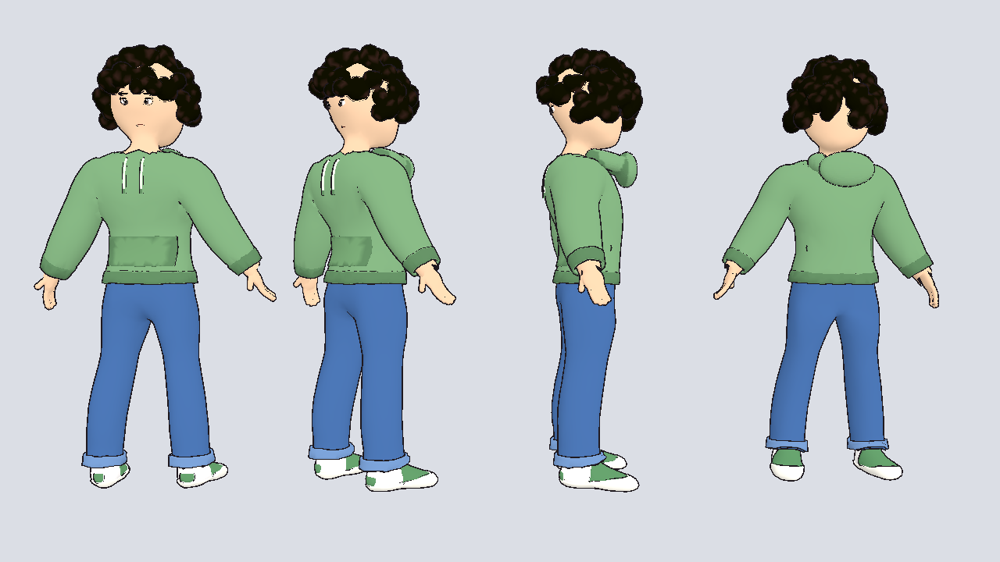
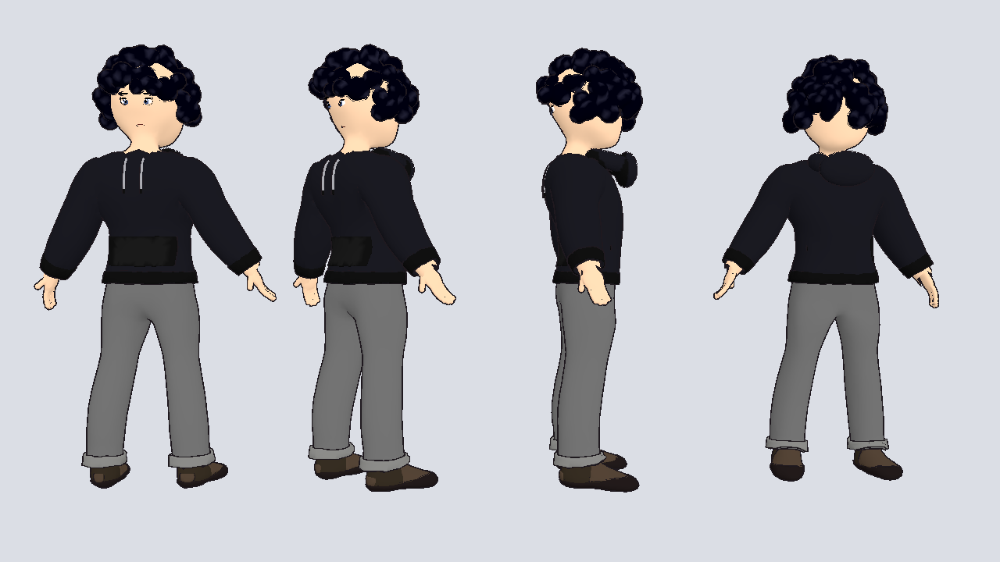
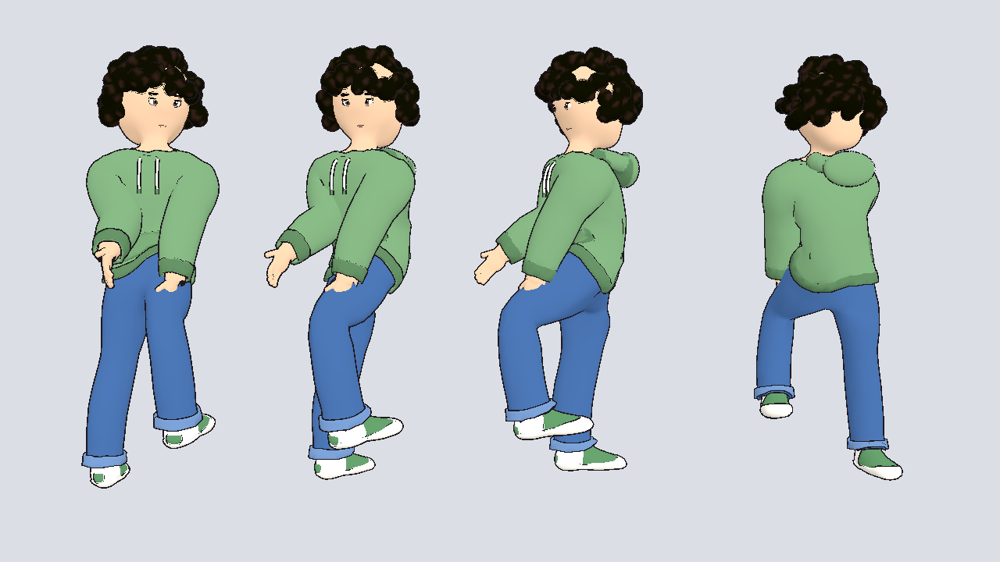
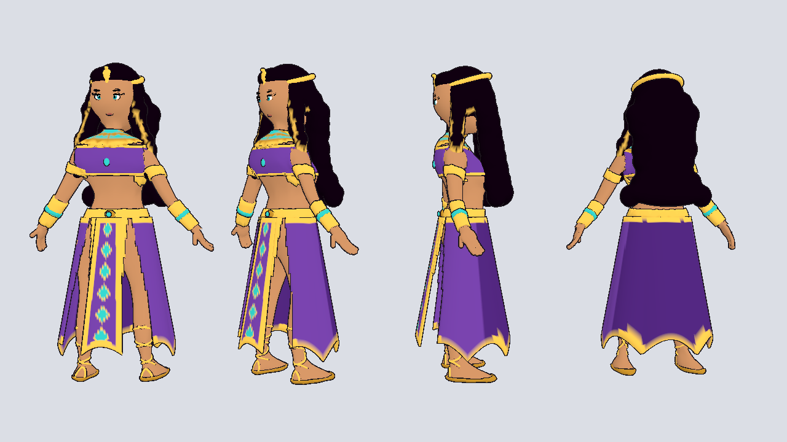
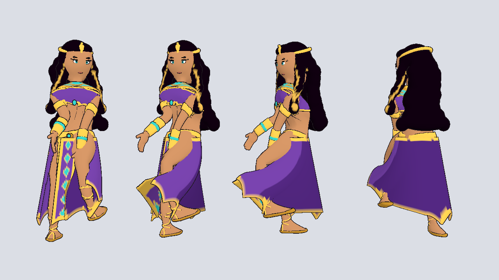
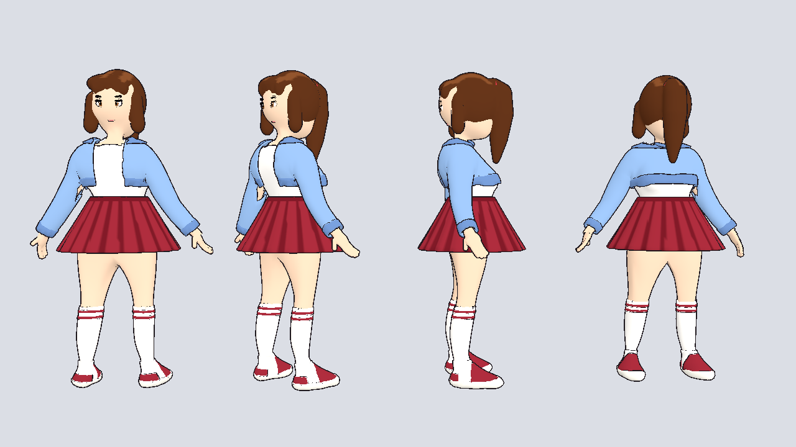
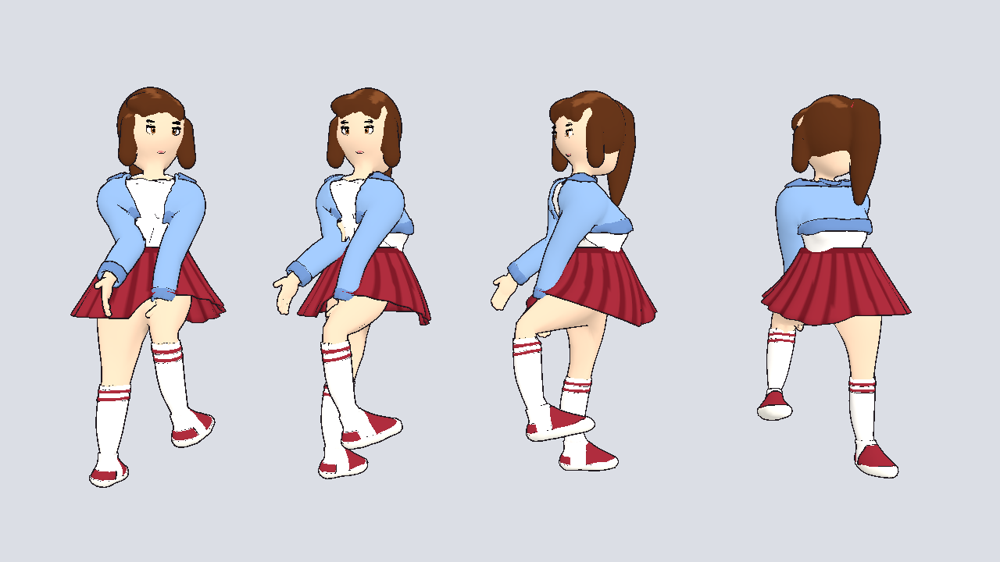

# Characters

| Character | Built on | Script |
|-----------|----------|--------|
| Hoodie guy (green, and a black variant) | Meshy male base (`bases/`) | `build_hoodie_guy.py` |
| Egyptian queen (Meshy body) | Meshy female base | `build_queen_meshy.py` |
| Casual girl | Meshy female base | `build_casual_girl.py` |
| Egyptian queen (original) | Blob-sculpted body | `build_egyptian_queen.py` |

All of them share the same 22 humanoid bone names, so one set of
retargeted animations works for every character.

## Hoodie guy

Curly-haired guy in an oversized hoodie (hood down, drawstrings, kangaroo
pocket, ribbed hem and cuffs), baggy jeans with rolled cuffs and sneakers
with colored heels and toe caps. `hoodie_guy_black.glb` is the black
hoodie / grey pants / dark shoes version. About 45k triangles each.

How it's made (`base_character.py`, reusable for any new character):

- The Meshy base is scaled to 1.78 m, centered, turned to face +Z in Godot
  and smoothed. Its mitten hands are replaced with anime hands.
- Joint positions come from the mesh itself (the arms are traced from the
  fingertips), and the body is skinned automatically.
- Clothing is the body's own surface lifted outward, trimmed with clean
  cuts, so it always fits; it copies the body's skin weights. Skin hidden
  under clothes is deleted.
- New outfits are a color table (`OUTFITS` in `build_hoodie_guy.py`): add an
  entry and re-run to get another variant.

## Egyptian queen on the Meshy female base

`egyptian_queen_meshy.glb`: the same outfit as the original queen, rebuilt
to fit the female base: fitted bandeau top with gold trim, belt that stays on
the hips, split skirt with a finely detailed front panel, usekh collar
following the shoulders, arm bands and bracers, cobra headband, sandal
straps and long hair with gold streaks. About 58k triangles.

## Casual girl

`casual_girl.glb`: high ponytail with side-swept bangs, cropped light-denim
jacket open over a white tank top, pleated wine-red mini skirt, striped knee
socks and sneakers. About 60k triangles. Add color schemes to `OUTFITS` in
`build_casual_girl.py` for variants.

Shared building blocks live in `base_character.py`: `garment` (clothes
lifted from the body with clean cut edges), `arm_band`, `ring_skirt`
(straight, flared, pleated or split skirts), `sandal_straps`, `sneakers`,
`curly_hair`, `anime_eyes` and `replace_hands`.

# Egyptian queen (blockout)

Stylized, rigged blockout of the Egyptian queen character, built from the
base-body sheet and the outfit art. Ready for Godot 4.7.

| File | What it is |
|------|------------|
| `egyptian_queen.glb` | Game model: body, outfit, hair, face, 22-bone humanoid skeleton |
| `egyptian_queen.blend` | Same model, for editing in Blender |
| `build_egyptian_queen.py` | The script that generates everything |

About 47k triangles, one material (vertex colors), 1.68 m tall to the top of
the head, standing in an A-pose like the base-body sheet.

## What's modeled

- Anime-proportioned body with tan skin
- Purple halter top with gold trim and a turquoise gem
- Gold belt, upper-arm bands and bracers
- Floor-length purple skirt split on both sides of a front panel with gold
  borders and a column of turquoise diamonds, jagged gold hem
- Gold and turquoise usekh collar
- Cobra (uraeus) headband and turquoise drop earrings
- Long wavy black hair with gold streaks framing the face
- Big teal anime eyes with a kohl wing, brows and lips
- 3D sandal straps criss-crossing up the calves, gold soles

## Using her in Godot

1. Copy the `characters/` folder into your project (the toon outline
   material lives in `pets/pet_toon.tres`, so copy that too).
2. Drag `egyptian_queen.glb` into a scene and set `pet_toon.tres` as the
   mesh's material override for the cartoon look. She faces +Z.

## Animations (Mixamo or any humanoid set)

The bones use Godot's humanoid names (`Hips`, `Spine`, `Chest`,
`UpperChest`, `Neck`, `Head`, `LeftShoulder`, `LeftUpperArm`,
`LeftLowerArm`, `LeftHand`, `LeftUpperLeg`, `LeftLowerLeg`, `LeftFoot`,
`LeftToes`, and the `Right...` versions), so retargeting is automatic:

1. Double-click `egyptian_queen.glb` → Advanced Import Settings → select the
   `Skeleton3D` → **Retarget → Bone Map → New BoneMap**, profile
   **SkeletonProfileHumanoid**. The bones map themselves.
2. Import each Mixamo animation file the same way (Mixamo bones also
   auto-map to the humanoid profile).
3. Put the animations in an `AnimationLibrary` and play them on the queen.

There are no finger bones yet, so hands stay in their rest shape.

## Known blockout limits

- The skirt and hair are skinned to the legs and chest, not simulated. For
  flowing cloth, add a few extra skirt/hair bones with Godot's
  `SpringBoneSimulator3D` later.
- The face is built from small shapes, not a texture, so expressions (like
  the angry/surprised sheet) would need blend shapes or swappable eye/mouth
  pieces.
- No cape yet (the see-through purple cape from the first outfit drawing).
