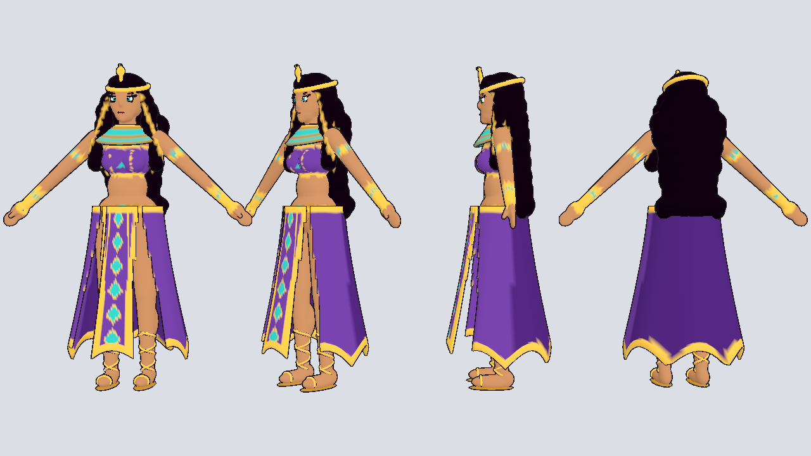
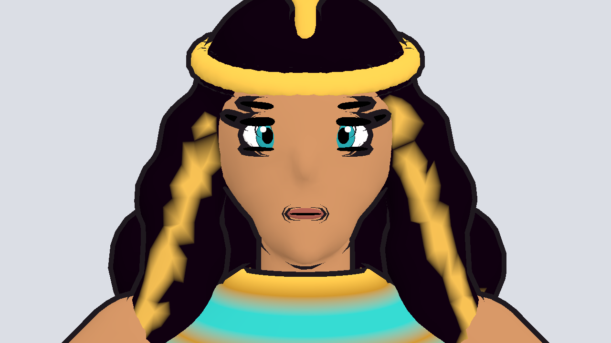
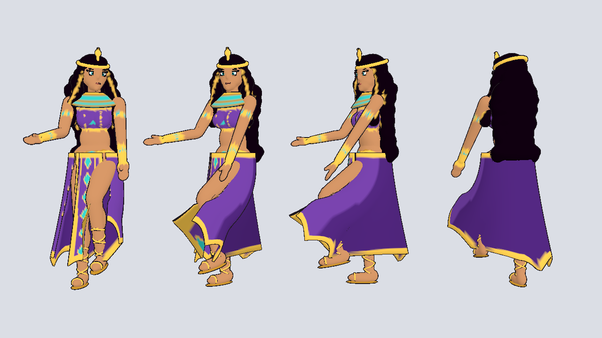

# Egyptian queen (blockout)

Stylized, rigged blockout of the Egyptian queen character, built from the
base-body sheet and the outfit art. Ready for Godot 4.7.

| File | What it is |
|------|------------|
| `egyptian_queen.glb` | Game model: body, outfit, hair, face, 22-bone humanoid skeleton |
| `egyptian_queen.blend` | Same model, for editing in Blender |
| `build_egyptian_queen.py` | The script that generates everything |

About 47k triangles, one material (vertex colors), 1.68 m tall to the top of
the head, standing in an A-pose like the base-body sheet.

## What's modeled

- Anime-proportioned body with tan skin
- Purple halter top with gold trim and a turquoise gem
- Gold belt, upper-arm bands and bracers
- Floor-length purple skirt split on both sides of a front panel with gold
  borders and a column of turquoise diamonds, jagged gold hem
- Gold and turquoise usekh collar
- Cobra (uraeus) headband and turquoise drop earrings
- Long wavy black hair with gold streaks framing the face
- Big teal anime eyes with a kohl wing, brows and lips
- 3D sandal straps criss-crossing up the calves, gold soles

## Using her in Godot

1. Copy the `characters/` folder into your project (the toon outline
   material lives in `pets/pet_toon.tres`, so copy that too).
2. Drag `egyptian_queen.glb` into a scene and set `pet_toon.tres` as the
   mesh's material override for the cartoon look. She faces -Z.

## Animations (Mixamo or any humanoid set)

The bones use Godot's humanoid names (`Hips`, `Spine`, `Chest`,
`UpperChest`, `Neck`, `Head`, `LeftShoulder`, `LeftUpperArm`,
`LeftLowerArm`, `LeftHand`, `LeftUpperLeg`, `LeftLowerLeg`, `LeftFoot`,
`LeftToes`, and the `Right...` versions), so retargeting is automatic:

1. Double-click `egyptian_queen.glb` → Advanced Import Settings → select the
   `Skeleton3D` → **Retarget → Bone Map → New BoneMap**, profile
   **SkeletonProfileHumanoid**. The bones map themselves.
2. Import each Mixamo animation file the same way (Mixamo bones also
   auto-map to the humanoid profile).
3. Put the animations in an `AnimationLibrary` and play them on the queen.

There are no finger bones yet, so hands stay in their rest shape.

## Known blockout limits

- The skirt and hair are skinned to the legs and chest, not simulated. For
  flowing cloth, add a few extra skirt/hair bones with Godot's
  `SpringBoneSimulator3D` later.
- The face is built from small shapes, not a texture, so expressions (like
  the angry/surprised sheet) would need blend shapes or swappable eye/mouth
  pieces.
- No cape yet (the see-through purple cape from the first outfit drawing).
