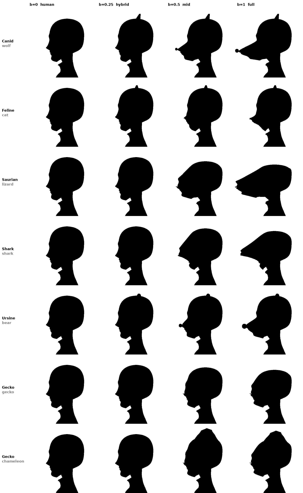
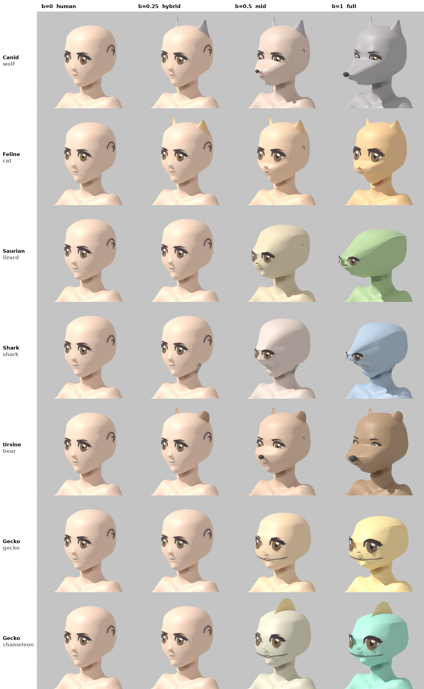

# Beast skulls

Separate head shapes for each skull type, replacing the one shared `TR_Muzzle`. The shapes are built
on the Toriyama kit base head (`toriyama_kit/base/M/M.glb`, the same head F uses). The plan is in
`docs/BEAST_HEADS_FIX.md`.

## Files

| File | What it is |
|------|------------|
| `tr_beast_skulls.py` | Blender module: skull settings, `add_skull_keys()`, `make_parts()`, `beast_values()` |
| `render_skulls.py` | Loads a kit base, adds the keys and parts, and renders the two check sheets |
| `beast_skulls_M.glb` / `.blend` | Kit base M with the new keys and parts, ready to look at in Blender or Godot |

To rebuild: `pip install bpy pillow`, then
`python3 render_skulls.py <path>/toriyama_kit/base/M/M.glb <out dir>`.
Add `ROWS=shark,bear` in front of the command to render only some lineages.

## New shape keys

On `Head_Base` and every face decal (eyes, brows, mouth, nose, ear ink, AE_*):
`TR_Skull_<Type>_Mid/Full` for Canid, Feline, Saurian, Shark, Ursine and Gecko.
All the existing keys (expressions, `TR_Chin`, `Pose_Rest`, body shapes) are left alone.

- **Canid** (wolf, dog, fox): long tapered snout, a clear stop under the eyes, the nose pad sits
  lower than the eyes and the lower jaw is shorter than the upper.
- **Feline** (cat, lion, tiger): short muzzle pad, human nose flattened, puffed cheeks, very little
  chin and bigger eyes.
- **Saurian** (lizard, croc, horned and crested dragon): no stop, the forehead slopes straight into
  a long flat snout, flattened crown, heavy brow, eyes pushed back and turned toward the sides.
- **Shark**: the forehead runs into a pointed rostrum over an underslung mouth, the chin tucks back,
  the throat fills in so the head runs into the neck, and the eyes sit on the sides.
- **Ursine** (bear): round, wider skull, a short broad blunt snout, puffed cheeks and small eyes.
- **Gecko** (gecko, chameleon, winglet dragon): wide round head with a flat face and almost no
  snout, receding chin, flattened crown, and big eyes that look out to the sides.

Reptiles and sharks get slimmer brow decals, so their faces don't read as human.

Eyes and brows move as rigid pieces, so the painted eyes never smear, and they snap onto the
reshaped skin.

## Parts

Parts are skinned to `DEF-head`:

- `TR_Beast_Nose_<Type>`: dog nose pad, small pink cat triangle, or two lizard nostrils. Each one
  carries its type's skull keys, so it slides from the human nose out to the snout tip. The human
  nose decals shrink away in those keys.
  The bear gets a bigger pad and the gecko smaller nostrils.
- `TR_Beast_Ears_<Type>`: tall wolf ears, wide cat ears, or small round bear ears. Lizards, sharks
  and geckos have none. The human ears tuck into the skull as the slider goes up.
- `TR_Beast_Mouth_Shark` + `TR_Beast_Teeth_Shark`: a grin with a row of teeth under the rostrum.
- `TR_Beast_Mouth_Gecko`: the big smile that wraps round to the cheeks.
- `TR_Beast_Gills_Shark`: three slits on each side of the jaw. They show from the hybrid stage,
  like the fish girl in the aquatic sheet.
- `TR_Beast_Casque_Gecko`: the chameleon crest along the top of the head. It only shows for the
  `chameleon` lineage.

The mouth, teeth and casque are laid on the head surface and carry the skull keys, so they stay on
the skin as it reshapes.

## Godot side

For each head mesh, set the values from `beast_values(lineage, b)`:
`mid = clamp((b - .25) / .25)`, `full = clamp((b - .5) / .5)`,
`TR_Skull_<Type>_Mid = mid * (1 - full)`, `TR_Skull_<Type>_Full = full`, and 0 for every other
type. `parts_visible(lineage, b)` says which part sets to show: ears and gills from b ≥ 0.2,
nose, mouth and the chameleon casque from b ≥ 0.3.

## Not done yet

- Fox's narrower snout; the Lagomorph, Manta, Cephalo and Aquatic skulls; horns, dragon crests
  and fins.
- Fur and scale materials. The sheet colors are flat preview colors.
- A mouth line for the wolf, cat, lizard and bear. The shark and gecko have one; the others
  still carry the human mouth decal out to the snout tip.
- The ears are simple cupped cards and could use a proper sculpt.
