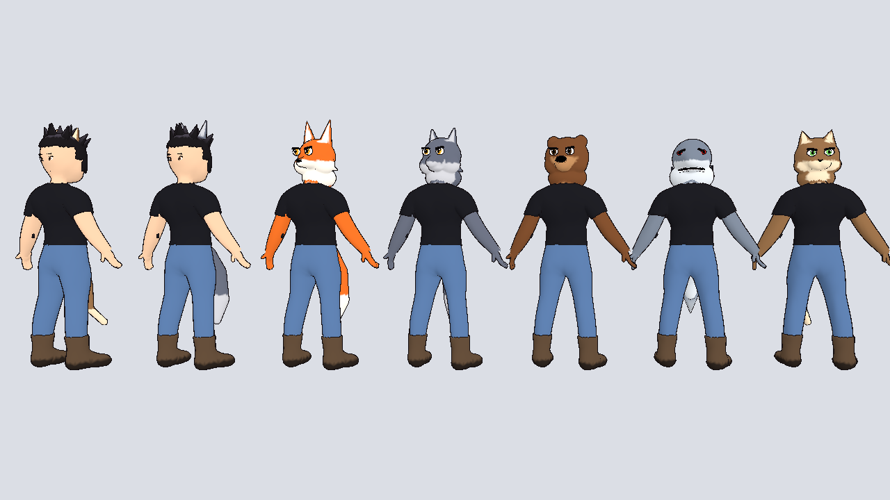
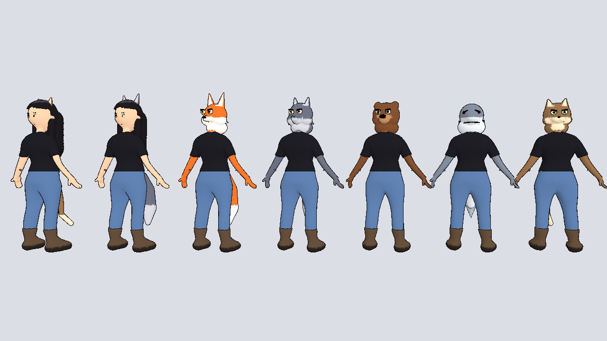
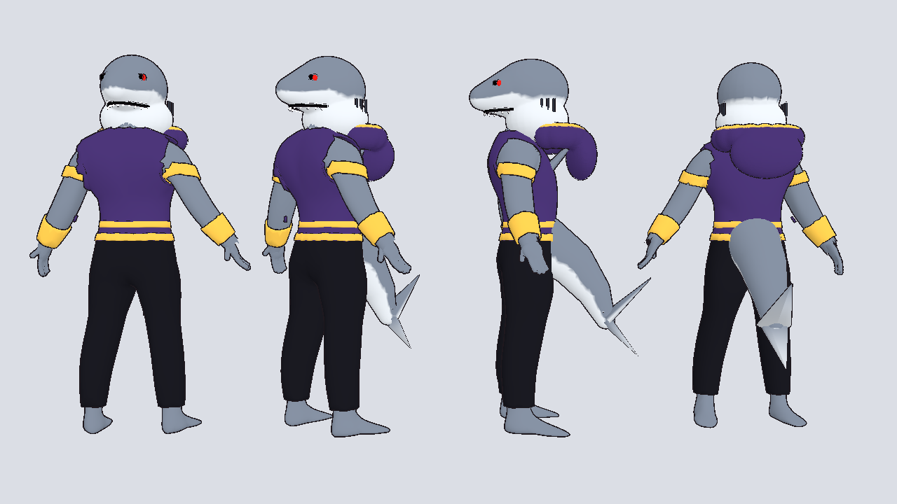
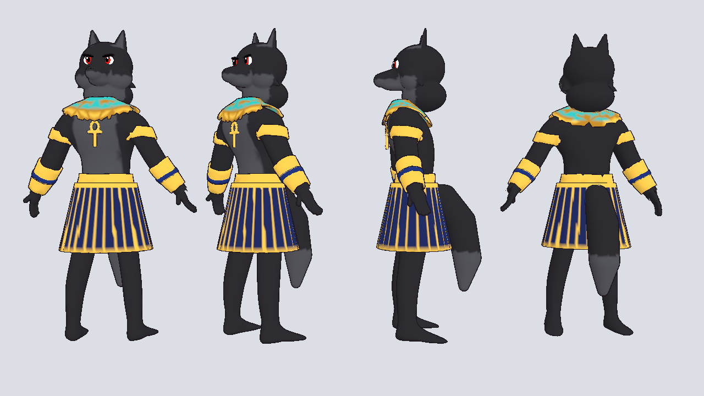

# Beastfolk

A customizable beastfolk body (male and female) plus two finished NPCs.

Left to right: cat hybrid, wolf hybrid, then beast-form fox, wolf, bear,
shark and cat, all from one file with different settings.

## Files

| File | What it is |
|------|------------|
| `../beastfolk_male.glb`, `../beastfolk_female.glb` | Every part as its own mesh on one humanoid skeleton |
| `beastfolk.gd` | Customizer script (`class_name Beastfolk`) |
| `beastfolk_toon.gdshader` | Recolors parts from their marking masks, with toon shading |
| `../npc_shark.glb`, `../npc_wolf_egypt.glb` | Finished NPCs with fixed colors |
| `../build_beastfolk.py` | Generates all of the above |

## Using the customizer

1. Copy `characters/` (including this `beastfolk/` folder) into your project.
2. Make a scene with a `Node3D` root, attach `beastfolk.gd` to it, and
   instance `beastfolk_male.glb` (or female) as its child.
3. In the Inspector pick:
   - **Species**: Human, Cat, Wolf, Fox, Bear, Shark
   - **Form**: Hybrid (human head, hair, animal ears and tail) or Beast
     (animal head, furred body)
   - **Show Clothes**, and colors for fur, markings, skin, hair, shirt,
     pants and boots. Turn off **Use Species Colors** to pick your own fur.

It works in the editor too (it's a `@tool` script), so you can see changes
live. From code: `$Beastfolk.species = Beastfolk.Species.FOX`.

For multiplayer, sync `species`, `form` and the color properties (for example
with a `MultiplayerSynchronizer`) and every client builds the same look.

### Parts in each file

`body`, `hands`, `head_human`, `face_human`, `hair`, `shirt`, `pants`,
`boots`, `ears_cat/wolf/fox/bear`, `head_cat/wolf/fox/bear/shark`,
`face_cat/wolf/fox/bear/shark`, `tail_cat/wolf/fox/bear/shark`, `fin_shark`.

Tinted parts store a marking mask in their vertex colors (black = main color,
white = markings like muzzles, bellies, inner ears and tail tips), so any
color scheme works without new models.

## NPCs

- `npc_shark.glb`: grey shark with a pale belly, red eyes, toothy grin and
  gills; purple sleeveless vest with gold trim and a hood, gold belt and arm
  bands, dark trousers, dorsal fin and tail.
- `npc_wolf_egypt.glb`: black-furred wolf with red eyes; gold and turquoise
  usekh collar with an ankh, gold arm bands and bracers, gold belt and a navy
  and gold pleated shendyt kilt; tail.

Use `pets/pet_toon.tres` as their material override for the outline.

## Limits (v1)

- Tails and the shark fin are rigid (skinned to the hips); a later pass can
  add tail bones for swishing.
- Clothes are one outfit (tee, jeans, boots); jackets, hoodies and more
  outfits can be added as extra parts the same way.
- Animal heads have one expression; there's no talking mouth yet.
