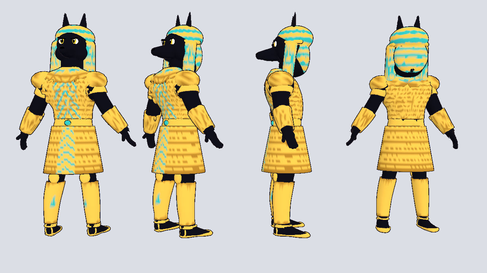
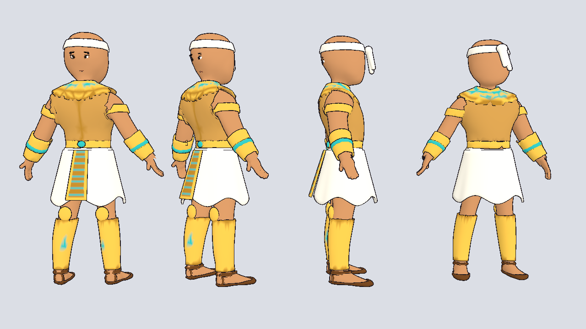
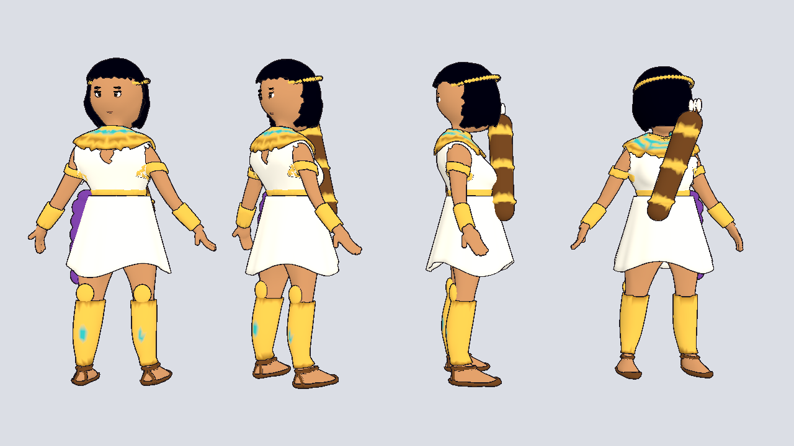

# Egyptian warriors

NPCs from the Egyptian warrior sheet, built on the Meshy bases with the same
humanoid skeleton as every other character. Built by
`../build_egypt_warriors.py`.

| File | Character | Weapon |
|------|-----------|--------|
| `../npc_anubis.glb` | Anubis guard: jackal head, striped nemes headdress, gold scale armor, scale skirt with turquoise chevrons, greaves | `../weapons/spear.glb` |
| `../npc_egypt_warrior.glb` | Bald warrior: linen headband, bronze chest plate, usekh collar, white kilt with a gold and turquoise front panel, bracers, greaves, sandals | `../weapons/axe.glb` |
| `../npc_egypt_archer.glb` | Archer: black bob, gold circlet, white wrap dress, purple sash, quiver on her back, greaves, sandals | `../weapons/bow.glb` |

## Weapons

`../weapons/` holds `spear.glb`, `axe.glb`, `bow.glb` and `quiver.glb`.
Each weapon's origin is its grip and it points up. To put one in a hand:

1. Under the character's `Skeleton3D`, add a `BoneAttachment3D` and set its
   bone to `RightHand` (spear, axe) or `LeftHand` (bow).
2. Instance the weapon `.glb` as its child and rotate it to sit in the palm.

Use `pets/pet_toon.tres` (or `farm/dq_toon.tres` for thicker outlines) as
the material override.
