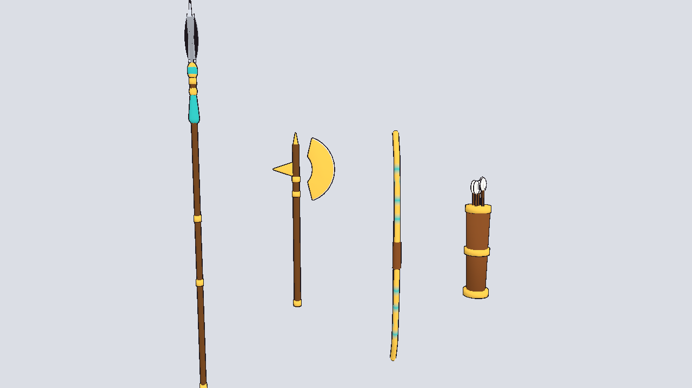

# Weapons

Egyptian-style weapons for the warriors in `../egypt/` (and anyone else).
Built by `build_weapons.py`.

| File | Notes |
|------|-------|
| `spear.glb` | 2.4 m spear, leaf blade, gold bands, turquoise tassel |
| `axe.glb` | 1.0 m battle axe with a crescent head |
| `bow.glb` | 1.45 m recurve bow with string |
| `quiver.glb` | leather quiver with arrows |

Each weapon's origin is its **grip**, and it points up (+Y in Godot), so it
can go straight under a `BoneAttachment3D` on a hand bone (`RightHand` for
the humanoids). Rotate the attachment to taste for the pose you want.

Use `../../farm/dq_toon.tres` or any thick toon material as the override.

Rebuild: `cd characters/weapons && python build_weapons.py`.
