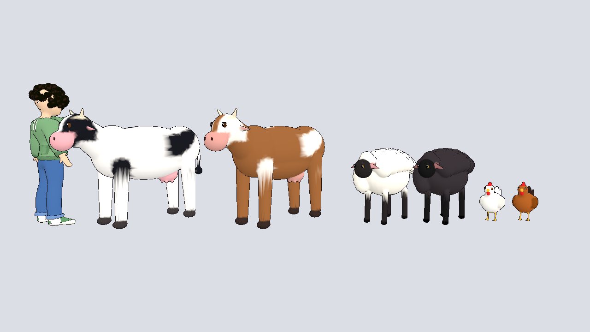
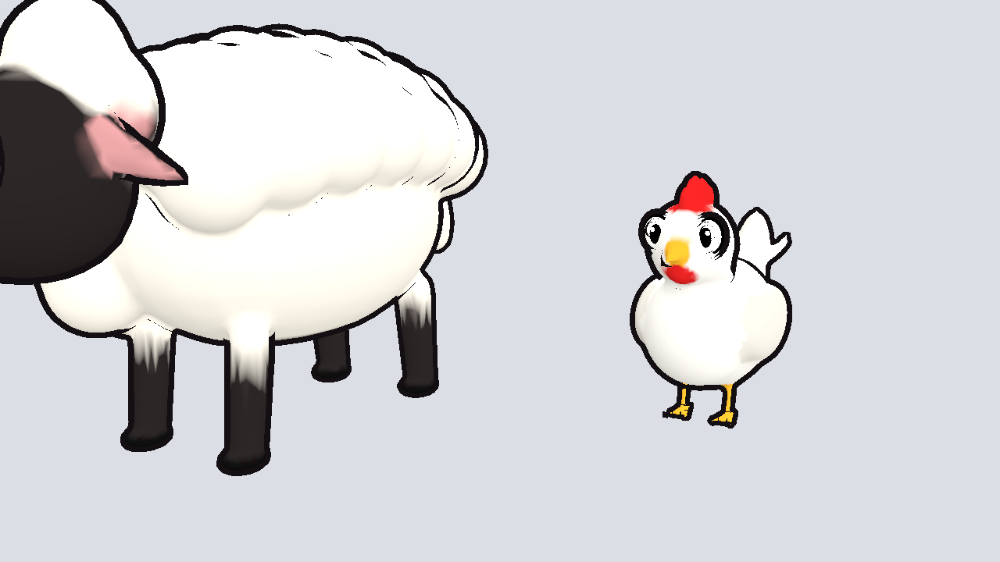
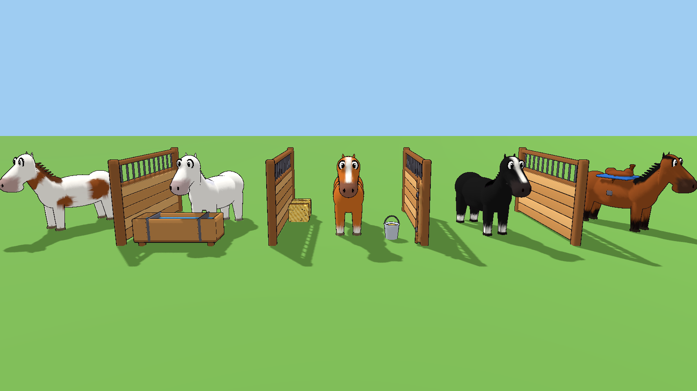

# Farm animals

Stylized, rigged farm animals in a Dragon Quest-inspired style (chunky
bodies, big heads, stubby legs, round Toriyama-style eyes, bold outlines),
shown next to the hoodie guy for scale.





| File | Animal |
|------|--------|
| `cow.glb` | Black-and-white cow (back at ~1.2 m) |
| `cow_brown.glb` | Brown-and-white cow |
| `sheep.glb` | White sheep with a dark face (~0.85 m) |
| `sheep_black.glb` | Black sheep |
| `horse_bay.glb` | Bay horse: brown with black mane, tail and legs (back at ~1.2 m) |
| `horse_chestnut.glb` | Chestnut with flaxen mane, white blaze and socks |
| `horse_white.glb` | White horse |
| `horse_black.glb` | Black horse with white blaze and socks |
| `horse_pinto.glb` | White and brown pinto |
| `chicken.glb` | White hen (~0.5 m) |
| `chicken_brown.glb` | Brown hen |

About 16–17k triangles each (horses 25 bones). Every animal has a skeleton (head, neck,
spine, legs, tail) and a looping `idle` animation (tail swish, breathing,
head bob), like the pets.

## Using them in Godot

Copy the `farm/` folder into your project, set `farm/dq_toon.tres` (thicker
outline for the Dragon Quest look) as the material override, and
set the `idle` animation to loop in the import settings. They face +Z (Godot's model front).

## Rebuilding

Coats are palettes in `build_farm.py` (`COW_COATS`, `SHEEP_COATS`,
`HORSE_COATS`, `CHICKEN_COATS`). Add an entry and run:

```
python farm/build_farm.py <name>
```

Saddles, hay, the barn, stalls and the chicken coop are in
`../props/farm/`.
