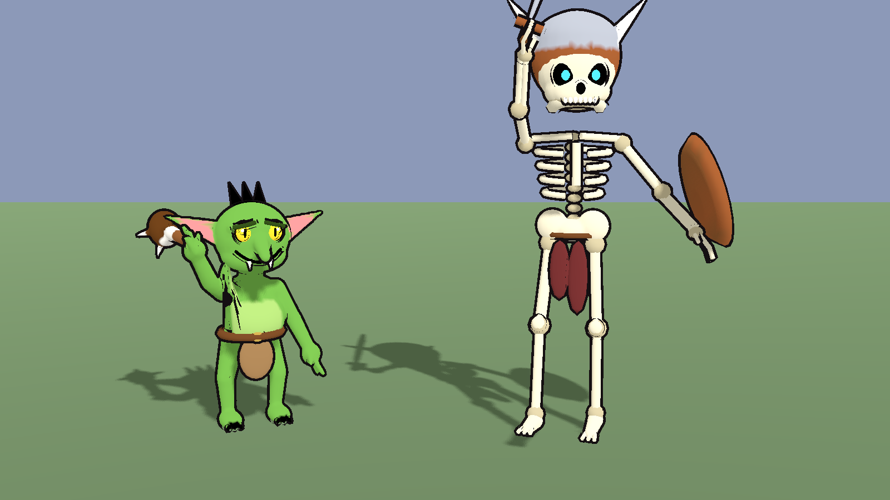
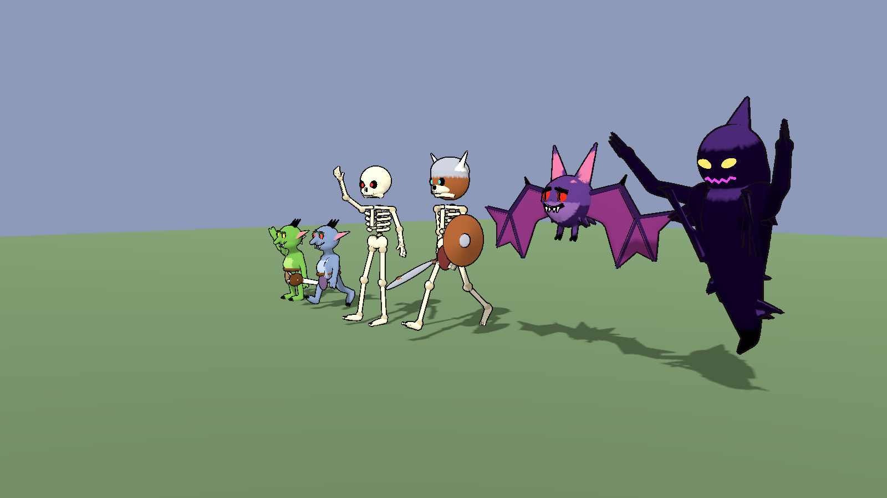

# Monsters

Dragon Quest / cartoon-style monsters, each with its **own creature rig**
(not the humanoid one) and animations baked in. Built by
`build_monsters.py`.





| File | Monster | Size | Animations |
|------|---------|------|------------|
| `goblin.glb` | green goblin with a spiked bone club | 1.05 m | idle, walk, attack |
| `goblin_cave.glb` | blue-grey cave goblin, red eyes | 1.05 m | idle, walk, attack |
| `skeleton.glb` | skeleton with glowing red eyes and a chattering jaw | 1.75 m | idle, walk, attack |
| `skeleton_warrior.glb` | skeleton with horned helmet, sword, shield, blue eyes | 1.9 m | idle, walk, attack |
| `nightmare_bat.glb` | fuzzy bat with huge wings and glowing red eyes, hovers at head height | 2.1 m wingspan | idle (flapping hover), attack (dive bite) |
| `shadow_entity.glb` | floating wraith of shadow with glowing eyes and grin | 2 m | idle (float), attack (claw lunge) |

About 17-28k triangles each.

## Facing: +Z

These face **+Z in Godot** (Godot's `MODEL_FRONT`, the same as glTF and
Mixamo), so they walk toward where they look without a 180° turn. `.R`
bones are on the monster's own right.

## Rigs

Each rig is made for its body:

- Goblin: pelvis, spine, chest, neck, head, ears, arms, hands, legs, feet.
  The club is weighted to `hand.R`.
- Skeleton: same layout plus a `jaw` bone; the sword is on `hand.R` and the
  shield on `forearm.L`.
- Bat: body, ears, legs, and each wing is `wing_1`, `wing_2` and three
  `finger` bones carrying the membrane.
- Shadow entity: body, chest, head, three tail bones and arms.

Every rig has a `root` bone at the floor. The animations move `root` for
bobbing and lunges, so turn off root motion or ignore it as you prefer.

## Glow

Eyes (and the shadow's grin) are a separate mesh named `glow`. Give it an
emissive or unshaded material so they shine in the dark, and use
`monster_toon.tres` on the rest for the outline:

```gdscript
for mi in find_children("*", "MeshInstance3D", true, false):
    mi.material_override = GLOW_MAT if mi.name.begins_with("glow") else TOON_MAT
```

## Using them

Instance the `.glb`, find its `AnimationPlayer` and play `idle`, `walk` or
`attack` (set them to loop in the import settings, except `attack`).

## Rebuilding

```
python monsters/build_monsters.py [goblin goblin_cave skeleton skeleton_warrior nightmare_bat shadow_entity]
```
