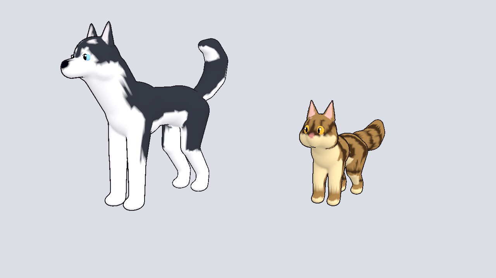
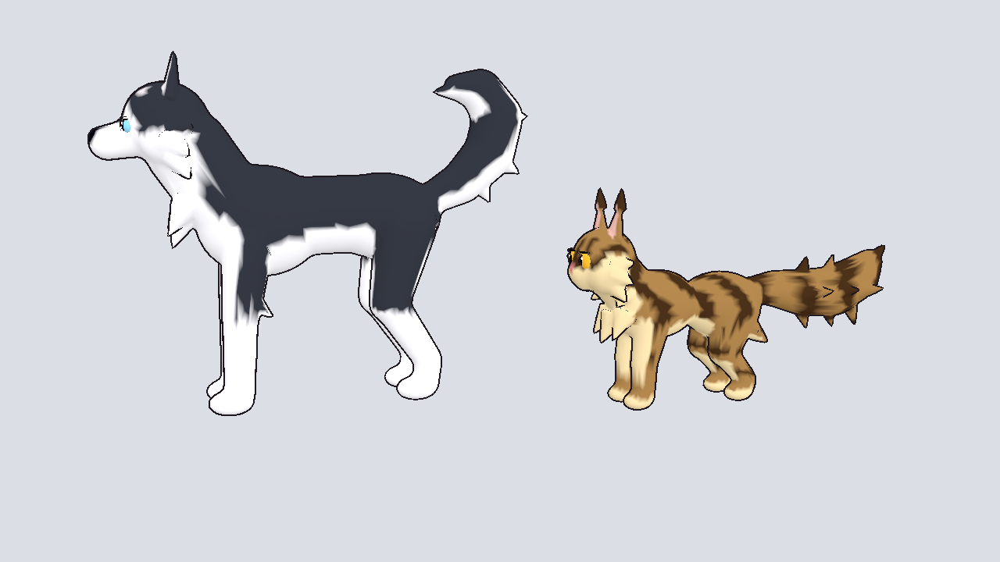

# Companion pets: Husky and Maine Coon

Stylized, rigged pet models built from the model sheets, ready to drop into
Godot 4.7: sheet proportions and markings, big cartoon eyes, a quadruped
skeleton and a looping idle animation.



All eight coats from the pet sheet (top: huskies, bottom: Maine Coons):


| File | Coat |
|------|------|
| `husky.glb` | H1 classic black and white, blue eyes |
| `husky_copper.glb` | H2 copper red and white, amber eyes |
| `husky_silver.glb` | H3 silver and white, blue eyes |
| `husky_white.glb` | H4 all-white (rare), blue eyes |
| `maine_coon.glb` | M1 classic brown tabby, amber eyes |
| `maine_coon_silver.glb` | M2 silver smoke, green eyes |
| `maine_coon_ginger.glb` | M3 ginger orange, green-gold eyes |
| `maine_coon_cream.glb` | M4 cream cameo (rare), copper eyes |

Every coat shares the same mesh, skeleton and `idle` animation, so a pet
scene can swap coats just by loading a different file. Coats are palettes in
`HUSKY_COATS` / `COON_COATS` in `build_pets.py`; add an entry to make a new one
(`python pets/build_pets.py <name>` rebuilds just that coat).



| File | What it is |
|------|------------|
| `husky.glb`, `maine_coon.glb` | Game models: mesh, vertex-color coat, skeleton, `idle` animation |
| `husky.blend`, `maine_coon.blend` | Same models, for editing in Blender |
| `pet_toon.tres` | Godot toon material with a dark cartoon outline |
| `build_pets.py` | The script that generates everything |

About 17k triangles and 27 bones each, with sculpted noses, mouths, toe bumps and (cats) whiskers. Heights: husky about 1.1 m to the
ear tips (thigh/waist height on the player), Maine coon about 0.65 m.

## Using them in Godot

1. Copy this `pets/` folder into your project.
2. Drag `husky.glb` or `maine_coon.glb` into a scene. Both face +Z (Godot's
   model front).
3. For the cartoon look, open the `.glb` import settings (double-click the
   file) and set `pet_toon.tres` as the material override on the mesh, or
   assign it as `material_override` on the `MeshInstance3D` in code.
4. The `AnimationPlayer` has a looping `idle` animation (tail wag, breathing,
   head bob). Set it to loop in the import settings.

## Bones

`root, pelvis, spine, chest, neck, head, jaw, ear.L/R, upper_arm.L/R,
forearm.L/R, front_paw.L/R, thigh.L/R, shin.L/R, hock.L/R, back_paw.L/R,
tail_1..tail_5`. Both pets use the same names, so animations and scripts can
be shared between them.

## Rebuilding

Needs Blender 5.x (or `pip install bpy` on Python 3.13):

```
cd pets && python build_pets.py            # all eight coats
cd pets && python build_pets.py husky_white  # just one
```
