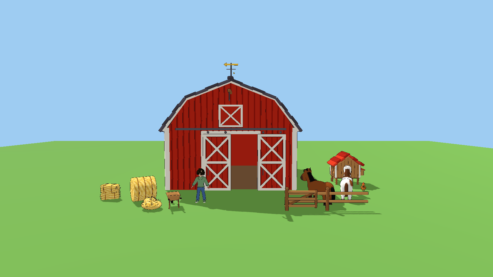
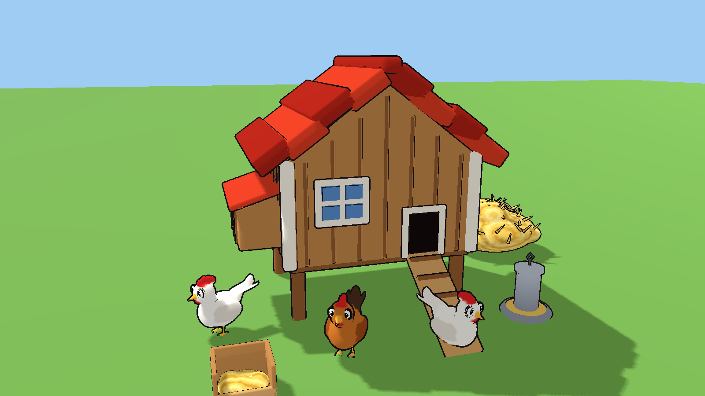
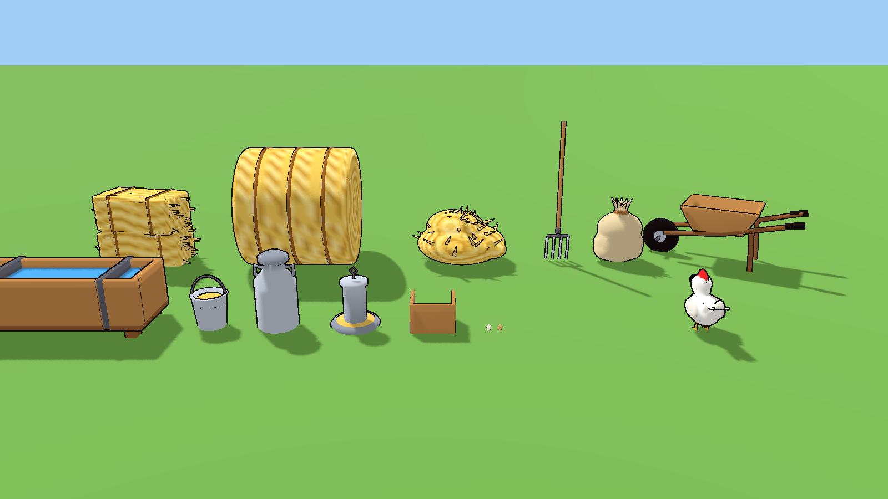

# Farm props (Dragon Quest style)

Chunky shapes, flat bright colors, thick outlines, to match the farm
animals in `../../farm/`. Real-world scale in meters, origin at the bottom
center, front facing -Z in Godot. Built by `../build_farm_props.py`.





## Hay

| File | Notes |
|------|-------|
| `hay_bale.glb` | square bale, 0.9 x 0.46 x 0.4 m with twine; stack at 0.4 m steps |
| `hay_round.glb` | round bale on its side, 1.3 m across, 1.2 m long |
| `hay_pile.glb` | loose heap, about 1.1 m across |
| `pitchfork.glb` | 1.6 m, stands on its tines |

## Barn and stalls

| File | Notes |
|------|-------|
| `barn.glb` | 8 x 10 m red gambrel barn, 7 m to the ridge, open 3.4 x 3.6 m doorway at the front, hayloft door, weather vane, dirt floor |
| `barn_door.glb` | one sliding door, 1.75 x 3.6 m. Closed: place at x = -0.87 and +0.87, y = 0, z = -5.22 (Godot) and slide along X to open |
| `stall_divider.glb` | wall between stalls, 3 m long (runs front to back), 1.7 m tall |
| `stall_gate.glb` | 1.2 m stall door; origin at the hinge, swings open from there |

## Fences

| File | Notes |
|------|-------|
| `fence_section.glb` | 2 m of rail fence with its left post; tile along X every 2 m |
| `fence_post.glb` | end post to cap a run |
| `fence_gate.glb` | 1.6 m gate; origin at the hinge |

## Chickens

| File | Notes |
|------|-------|
| `chicken_coop.glb` | coop on legs, 1.6 x 1.2 m, 2.1 m tall, with ramp, window and side nesting box |
| `nest_box.glb` | open nesting box with straw and two eggs |
| `egg.glb`, `egg_brown.glb` | 6 cm eggs, for collecting |
| `chicken_feeder.glb` | galvanized feeder with grain |

## Odds and ends

| File | Notes |
|------|-------|
| `water_trough.glb` | wooden trough, 1.6 x 0.6 m |
| `feed_bucket.glb` | bucket of grain |
| `feed_sack.glb` | tied grain sack |
| `wheelbarrow.glb` | wooden wheelbarrow |
| `milk_can.glb` | steel milk churn |
| `horse_saddle.glb` | saddle and blanket for the horses; sits on the back at (0, 1.16, 0) relative to the horse. To make it follow the idle animation, parent it to a BoneAttachment3D on the `spine` bone and keep that same position |

## Using them in Godot

Set `toon_large.tres` as the material override for the big pieces (barn,
coop, fences, bales) and `toon_small.tres` for small ones (eggs, bucket,
nest box) so the outline stays thin. Colors come from vertex colors. Add
collision with **Mesh > Create Collision Shape** (convex for small props,
trimesh for the barn so you can walk inside).

## Rebuilding

```
python props/build_farm_props.py [name ...]
```
