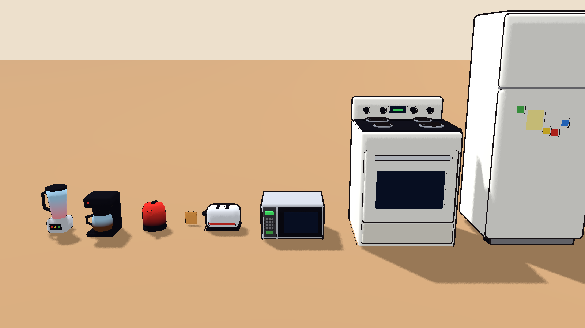
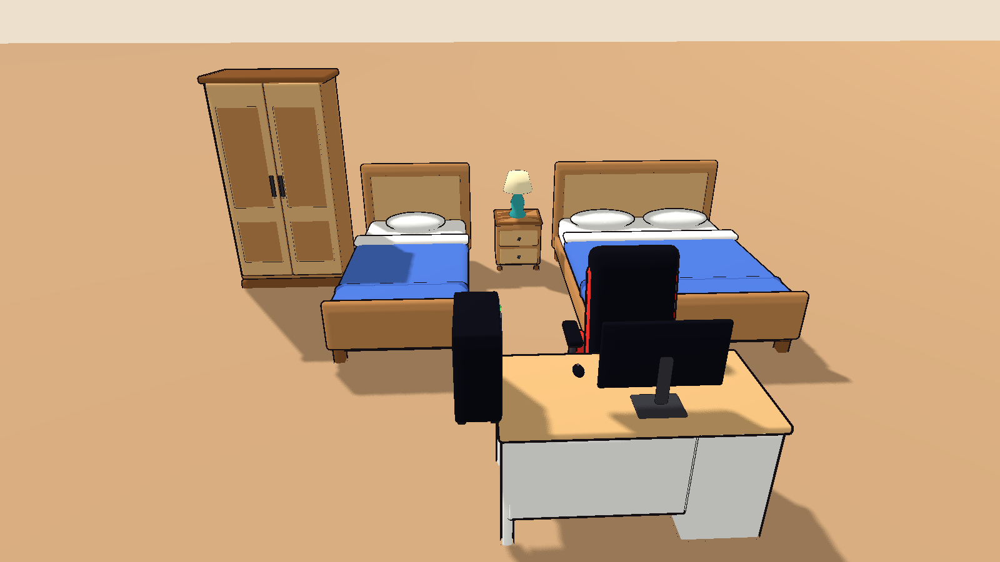
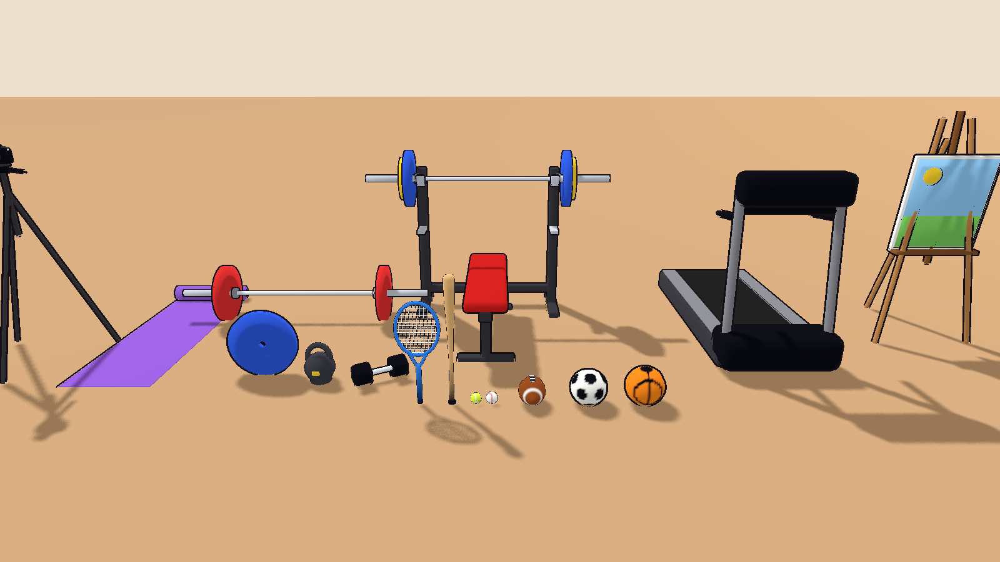
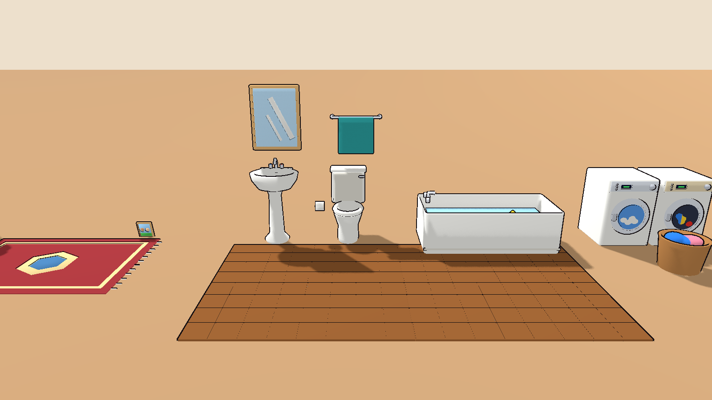
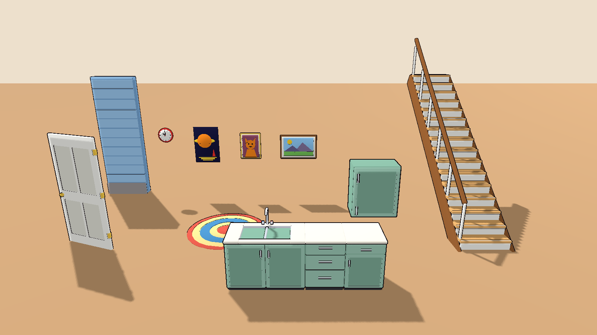

# House props

Chunky, rounded shapes (Dragon Quest) with bright flat colors and thick
outlines (Simpsons), like the farm and restaurant props. Real-world scale in
meters, origin at the bottom center, front facing +Z in Godot. Built by
`../build_house_props.py`.









## Kitchen

`fridge` (0.75 x 0.7 x 1.8 m, top freezer, magnets and a note), `stove`
(four coils, oven window, clock), `microwave`, `toaster` (two slots at
x = +-0.04, top at 0.2 m), `toast` (one slice, drops into a slot), `kettle`,
`coffee_maker`, `blender`.

## Living room

`tv` (55-inch, 1.25 m wide, stands on feet), `tv_stand` (top at 0.5 m),
`sofa` (three seats, 2 m), `coffee_table` (top at 0.42 m), `floor_lamp`,
`table_lamp`, `bookshelf` (1.8 m, filled with books).

## Bedroom and desk

`bed_single` (1.0 x 2.1 m), `bed_double` (1.6 x 2.1 m); headboard at the back,
foot toward the front. `nightstand`, `wardrobe` (2 m), `desk` (top at 0.75 m),
`gaming_chair`, `monitor`, `keyboard`, `mouse`, `pc_tower` (glass side with
colored fan rings).

## Game consoles (generic)

They echo familiar shapes but have no logos, names or brand markings:

| File | Looks like |
|------|------------|
| `console_tower` | tall two-tone console standing upright, white side panels around a dark core |
| `console_box` | square black tower with a vented top that glows green |
| `console_retro` | grey cartridge console with a cartridge plugged in |
| `console_hybrid` | handheld tablet with a blue left and red right controller, lying flat |
| `console_dock` | dock the hybrid stands in |
| `controller_black`, `controller_white` | twin-stick gamepads |

## Art and cameras

`paint_brush` (round artist's brush), `paint_brush_wide` (house-painting
brush), `paint_palette` (with paint dabs), `easel` (with a painting in
progress), `paint_can` (open, with stir stick). `camera_dslr` (lens toward
the front), `camera_instant` (photo slot on top), `instant_photo`, `tripod`
(camera plate at 1.38 m).

## Sports and gym

`basketball`, `soccer_ball`, `football`, `baseball`, `tennis_ball`,
`baseball_bat`, `tennis_racket`, `yoga_mat`. `dumbbell` (hex), `kettlebell`,
`weight_plate`, `barbell` (loaded, 2 m), `bench_press` (bench, rack and a
loaded bar; lie with your head toward the rack), `treadmill` (you face the
console at the front).

## Bathroom

`toilet` (tank at the back), `bathtub` (1.6 m, with water and a rubber duck),
`bathroom_sink` (pedestal, basin at 0.88 m), `bathroom_mirror`,
`towel_rack`, `bath_mat`, `toilet_paper`.

## Kitchen counters and laundry

`counter` (0.6 m base cabinet, counter at 0.9 m to match the fridge and
stove), `counter_drawers`, `counter_sink` (1.2 m, double steel basin and
faucet), `upper_cabinet` (hang the bottom at about 1.45 m), `washer`,
`dryer` (front loaders, 0.6 x 0.6 x 0.85 m), `laundry_basket`.

## Decor

`rug_round` (1.6 m), `rug_rect` (2 x 1.4 m), `painting_landscape`,
`painting_portrait` (a cartoon cat in a gold frame), `poster` (no text),
`wall_clock`, `photo_frame`, `potted_plant`.

Wall items (mirror, towel rack, upper cabinet, paintings, poster, clock)
have their origin at the back, so they sit flush when placed against a
wall with their front facing into the room.

Walls, floors, roofs and doors to build the house itself are in
`../house_kit/`.

## Screens

`tv`, `monitor`, `console_hybrid` and `treadmill` keep their display as a
separate child mesh called `screen`. Give it a material with a
ViewportTexture or video to show something on it; left alone it is a dark
blue screen.

## Using them in Godot

Set `toon_large.tres` as the material override on furniture and appliances
and `toon_small.tres` on small things (controllers, cameras, balls, toast)
so the outline stays thin. Colors come from vertex colors.

## Rebuilding

```
python props/build_house_props.py [name ...]
```
