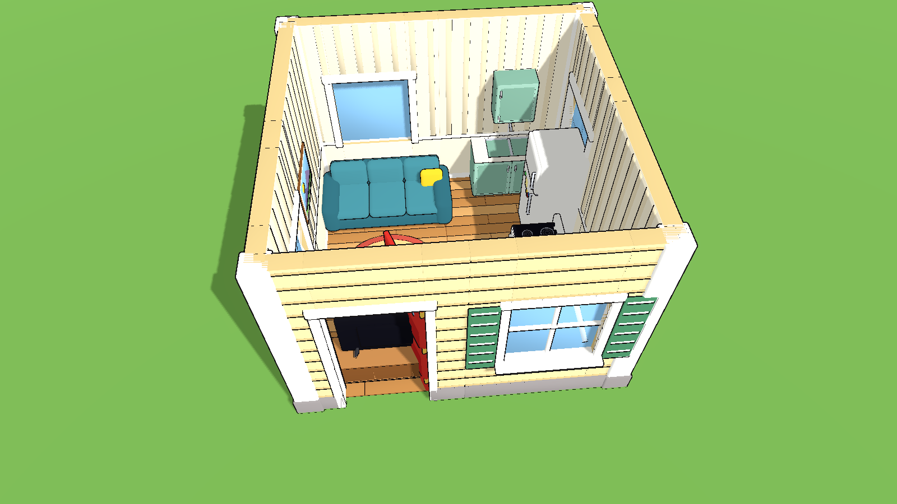

# House-building kit

Snap-together pieces for cartoony houses: lap-siding walls in three color
schemes, doors, windows with shutters, floors, a 30-degree shingle roof,
gables and stairs. Everything is on a **2 m grid with 3 m storeys**. Built
by `../build_house_kit.py`.




## Pieces

| File | Notes |
|------|-------|
| `wall_<scheme>` | 2 x 3 m wall, 0.2 m thick |
| `wall_half_<scheme>` | 1 m wide wall for odd lengths |
| `wall_door_<scheme>` | wall with a 1.1 x 2.2 m doorway and white trim |
| `wall_window_<scheme>` | wall with a 1.1 x 1.2 m window (sill at 0.9 m), glass, shutters |
| `gable_<scheme>_l`, `gable_<scheme>_r` | triangular infill under one roof cell, tall edge at local -X (`_l`) or +X (`_r`) |
| `corner_post` | white 0.3 m trim post for outside corners |
| `door_front` | red front door with a window; `door_interior` white panel door |
| `floor_wood`, `floor_tile`, `floor_carpet` | 2 x 2 m floor, top at 0.022 m |
| `roof_slope` | one 2 x 2 m cell of roof, rising 1.155 m |
| `roof_eave` | 0.5 m overhang with fascia and soffit |
| `roof_ridge` | cap for the peak |
| `stairs` | 1 m wide, climbs 3 m over 4 m, with a railing |

Schemes: `cream` (green shutters), `pink` (blue shutters), `blue` (white
shutters). Outside faces have siding and a stone footing; inside faces have
striped wallpaper, a chair rail and baseboards.

## How the pieces fit (Godot coordinates, y up)

Every piece faces **+Z** like the rest of the art: a wall's outside (siding)
is toward its local +Z, it runs along local X from -1 to +1, and its bottom
is at y = 0. For a 4 x 4 m house centered on the origin with the front at +Z:

| Piece | Rotation (y) | Position |
|-------|--------------|----------|
| front walls | 0 | (-1, 0, 2) and (1, 0, 2) |
| back walls | 180 | (-1, 0, -2) and (1, 0, -2) |
| left walls (outside toward -X) | -90 | (-2, 0, 1) and (-2, 0, -1) |
| right walls (outside toward +X) | 90 | (2, 0, 1) and (2, 0, -1) |
| `corner_post` | 0 | each corner, e.g. (-2, 0, 2) |
| floors | 0 | cell centers, e.g. (-1, 0, 1) |
| `door_front` in a `wall_door` at (wx, 0, wz), rotation r | r | the wall's local x = +0.53 (for the front wall at (-1, 0, 2): (-0.47, 0, 2)) |
| `roof_slope`, front half | 0 | (x, 3, 1) for x = -1, 1 |
| `roof_slope`, back half | 180 | (x, 3, -1) |
| `roof_eave` | 0 / 180 | (x, 3, 2) / (x, 3, -2) |
| `roof_ridge` | 0 | (x, 4.155, 0) |
| gables on the left wall | -90 | `gable_*_r` at (-2, 3, 1), `gable_*_l` at (-2, 3, -1) |
| gables on the right wall | 90 | `gable_*_l` at (2, 3, 1), `gable_*_r` at (2, 3, -1) |

- Doors swing from their hinge: rotate them **negative** around y to open
  inward (e.g. -70).
- `gable_*_l` has its tall edge at local +X, `gable_*_r` at local -X; pick
  the one whose tall edge meets the ridge.
- A roof slope's low edge is at its local +Z (on the wall line) and it rises
  1.155 m toward local -Z. For deeper houses chain more slope cells: each
  starts 1.155 m higher and 2 m further in.
- Upper storeys: stack walls at y = 3, 6, ...

Rugs and furniture go on top of the floor at y = 0.022.

## Materials

Use `toon_large.tres` as the material override. Colors are vertex colors.
Walls are thin boxes, so collision works well with **Create Trimesh Static
Body** or a box per wall.

## Rebuilding

```
python props/build_house_kit.py [name ...]
```

New color schemes are one line each in `SCHEMES`.
