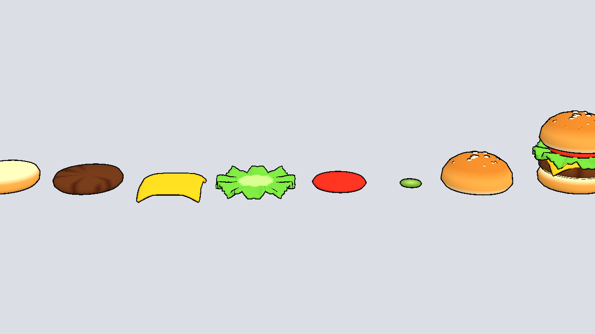
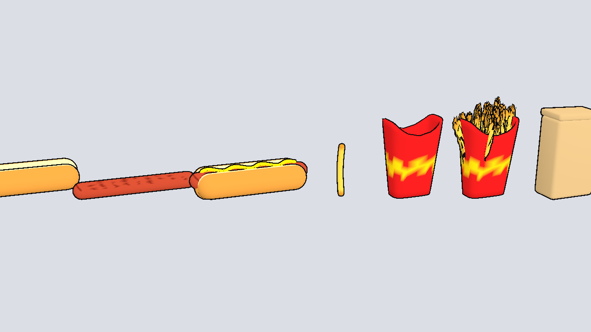
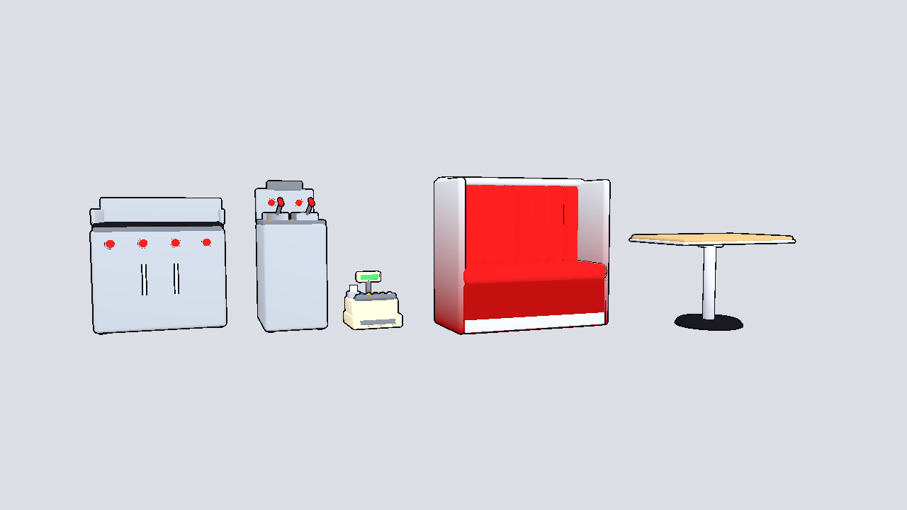
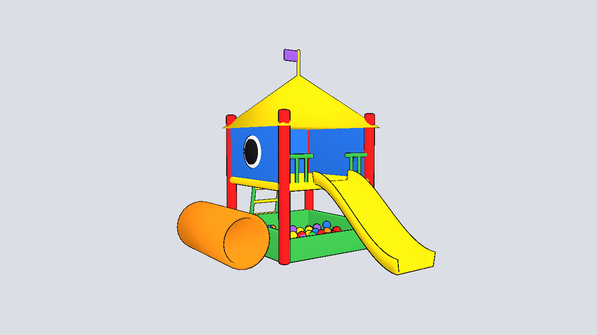

# Restaurant props (cartoony, Simpsons-style)

Bright flat colors, chunky rounded shapes, thick outlines. Real-world scale in
meters, origin at the bottom center, front facing +Z in Godot. Built by
`../build_restaurant.py`.

## Food (every layer is its own model)

| File | Notes |
|------|-------|
| `bottom_bun.glb` | 2.7 cm tall, cut side up |
| `patty.glb` | 1.8 cm |
| `cheese.glb` | square slice with drooping corners |
| `lettuce.glb` | ruffled leaf |
| `tomato.glb` | slice with seed pattern |
| `pickle.glb` | slice |
| `top_bun.glb` | sesame-seed dome |
| `burger.glb` | all of the above stacked (for display or menus) |
| `hotdog_bun.glb`, `sausage.glb`, `mustard.glb` | separate pieces |
| `hotdog.glb` | assembled |
| `fry.glb` | one fry |
| `fry_carton_empty.glb`, `fry_carton_full.glb` | red carton, empty or full |
| `fry_bag.glb` | paper fry bag with a red stripe |

Stacking heights for building a burger in game (bottom of each part): bottom
bun 0, patty 0.027, cheese 0.045, lettuce 0.05, tomato 0.059, pickle 0.067,
top bun 0.07. Sausage sits at 0.018 in the hot dog bun.

## Kitchen and dining room

| File | Size |
|------|------|
| `grill.glb` | flat-top grill, 1.0 x 0.72 m, cook surface at 0.88 m |
| `fryer.glb` | deep fryer with two baskets, 0.5 x 0.72 m |
| `cash_register.glb` | retro register with colorful keys |
| `booth.glb` | big red channel-tufted booth, 1.3 m wide (place two facing each other) |
| `table.glb` | tan table on a chrome pedestal, 1.1 x 0.72 m, 0.76 m tall |
| `fun_house.glb` | kids' play house on stilts with slide, ladder, crawl tube and ball pit (about 3 x 4 m) |

## Materials

- `toon_small.tres`: thin outline for food and small items.
- `toon_large.tres`: thick outline for furniture, equipment and the fun house.

Set one as the material override (or in the `.glb` import settings).
